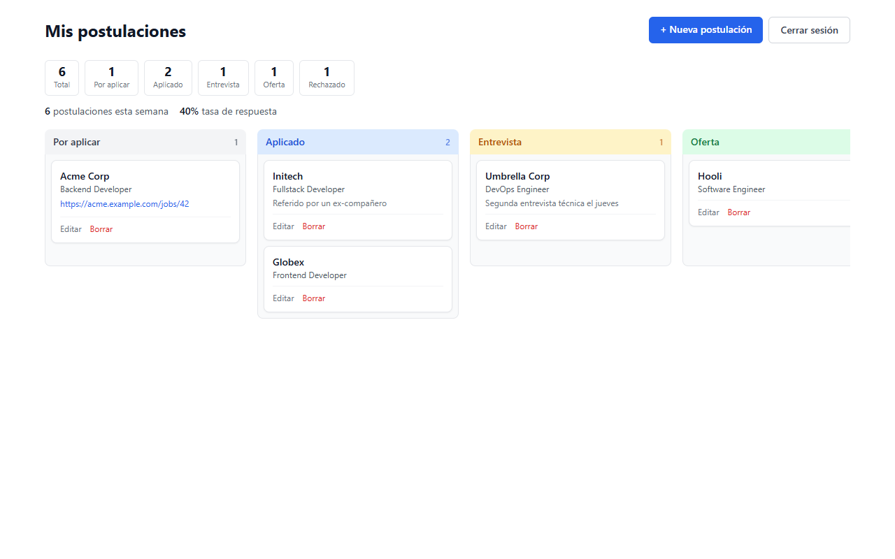
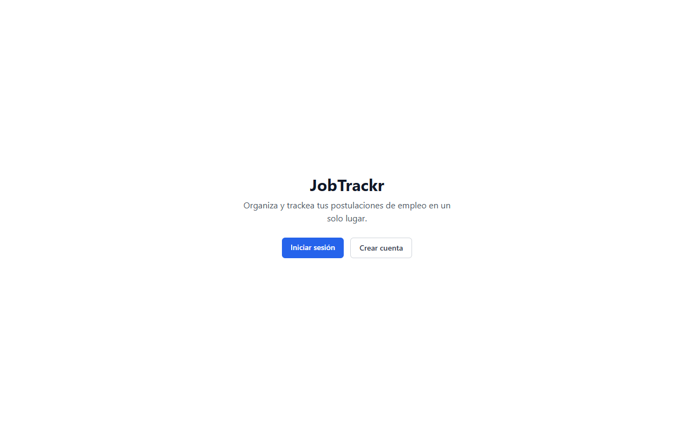
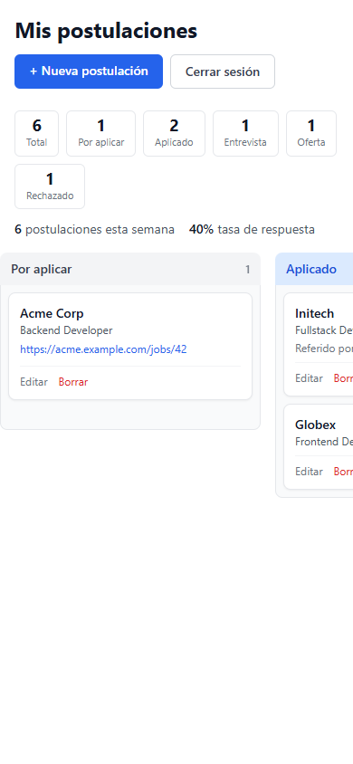

# JobTrackr — Frontend

Next.js 16 (App Router) + TypeScript + Tailwind CSS para JobTrackr. Plan completo del proyecto: [`PLAN.md`](./PLAN.md).

**Demo en vivo:** https://jobtrackr-frontend-two.vercel.app
(backend en Render, free tier — la primera visita después de un rato inactivo puede tardar ~30-50s en despertar)

Más capturas (inicio, mobile)

## Setup

1. `npm install`
2. Copia `.env.example` a `.env.local` y ajusta `NEXT_PUBLIC_API_URL` si el backend corre en otro puerto.
3. `npm run dev` — abre `http://localhost:3000`.

## Tests

- `npm test` — tests unitarios (Vitest) de `lib/api.ts` y `lib/auth.ts`. No requieren nada corriendo.
- `npm run test:e2e` — tests end-to-end (Playwright) contra la app real: registro, login, CRUD de postulaciones, expiración de token. **Requiere el backend corriendo** (`jobtrackr-backend`, `npm run dev`, puerto 4000) — si no está disponible, falla con un mensaje claro en vez de errores crípticos. Usa el Chrome instalado en el sistema (`channel: 'chrome'`), no descarga su propio binario.

## Deploy

Desplegado en **Vercel** (`vercel deploy --prod`), conectado al repo de GitHub para auto-deploy en cada push a `main`. Variables de entorno en producción: `NEXT_PUBLIC_API_URL` (backend en Render) y `NEXT_PUBLIC_SENTRY_DSN` (monitoreo de errores).

## Estado

**Fase 0 (setup) completada:** Next.js + TypeScript + Tailwind configurados, página de inicio placeholder.

**Fase 2 completada:** cliente API centralizado (`lib/api.ts`) con manejo de JWT vía `localStorage` (incluye auto-logout si el token expira), páginas de registro/login (con confirmación de contraseña), página protegida `/applications` con `/applications/new` (crear) y `/applications/[id]/edit` (editar todos los campos). Next.js actualizado a 16.3.5 por vulnerabilidad de seguridad. Cobertura de tests: unitarios (Vitest) + e2e (Playwright) + CI en GitHub Actions.

**Fase 3 completada:** `/applications` es ahora un tablero Kanban (`@dnd-kit/core`) con una columna por estado, drag & drop que actualiza el estado vía `PUT /applications/:id`, barra de métricas (total, conteo por estado, postulaciones de la semana, tasa de respuesta) y columnas swipeables en mobile (scroll horizontal con snap).

**Fase 4 completada:** el drag & drop se puede operar 100% por teclado (Tab → Space → flechas → Space, con anuncios en español para lectores de pantalla); un error al cambiar de estado o borrar ya no oculta el tablero completo (bug real que se corrigió); carga inicial fallida tiene botón "Reintentar"; contraste de color auditado con WCAG real; QA mobile en las 6 pantallas.

**Fase 5 completada:** deploy real en Vercel (frontend) + Render (backend, free tier), variables de entorno de producción separadas de desarrollo (`JWT_SECRET` propio, `FRONTEND_URL` restringiendo CORS al dominio real en vez de aceptar cualquier origen), flujo completo (registro → tablero → CRUD) verificado contra la app en producción real, no solo en local.

**Pulido post-Fase 5:** tests de integración del backend (ver su README), `@types/react`/`@types/react-dom` alineados con React 19, y monitoreo de errores en producción con **Sentry** — verificado con tráfico de red real, no solo que compile.
